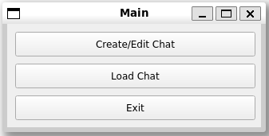

# 프로그램 매뉴얼

## 1. 프로그램 실행하기
1. 로컬LLM 사용 시 ```litellm --model ollama/llama3.1:8b-instruct-q8_0```와 같이 ollama를 사용해 설치한 로컬 LLM 서버 띄우기
2. ```python3 ./src/main.py```을 실행하여 프로그램 실행

## 2. 채팅 설정 파일 생성 및 변경하기
   
- 시작페이지에서 Create/Edit Chat 버튼을 클릭
   
- 채팅 설정에 관한 사용자 입력
    - LLM Config: 최상단에 위치한 LLM Configs는 사용자가 사용할 수 있는 LLM 설정에 관한 것이다.
        - 
    - Agents: 채팅에 참여하는 에이전트의 설정을 입력한다.
        - 에이전트의 이름, 배경 및 역할, 사용할 LLM, 사용자의 입력 여부 등을 설정한다.
    - Chat: 채팅 전반에 관한 설정을 입력한다.
        - 채팅을 시작하는 에이전트, 받는 에이전트, 최대 턴수, 에이전트가 맥락을 이해하기 위한 요약 방법, 초기 메시지 등을 설정한다.
- 또한 하단의 Load Config 버튼을 클릭하여 기존에 저장된 채팅 설정 파일을 불러올 수 있으며, Save Config 버튼을 통해 저장해야 한다.

## 3. 채팅 실행하기

- 위 2에서 저장한 채팅 설정 파일을 바탕으로 실제 작업을 수행하는 곳이다.
1. Select config 버튼을 클릭하여 저장된 설정 파일을 가져온다.
2. 하단의 입력 위치에 있는 초기 메시지를 입력하고 Enter 버튼을 통해 입력하면 작업을 수행한다.
3. Stop 버튼을 클릭하여 채팅 중간에 멈출 수 있다.
4. Reset 버튼을 클릭하여 현재의 작업 내용을 지우고 재시작할 수 있다.